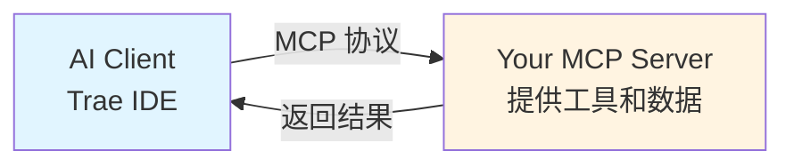
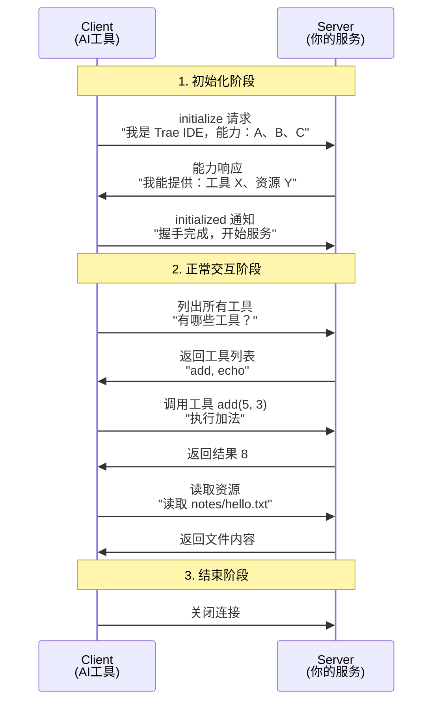
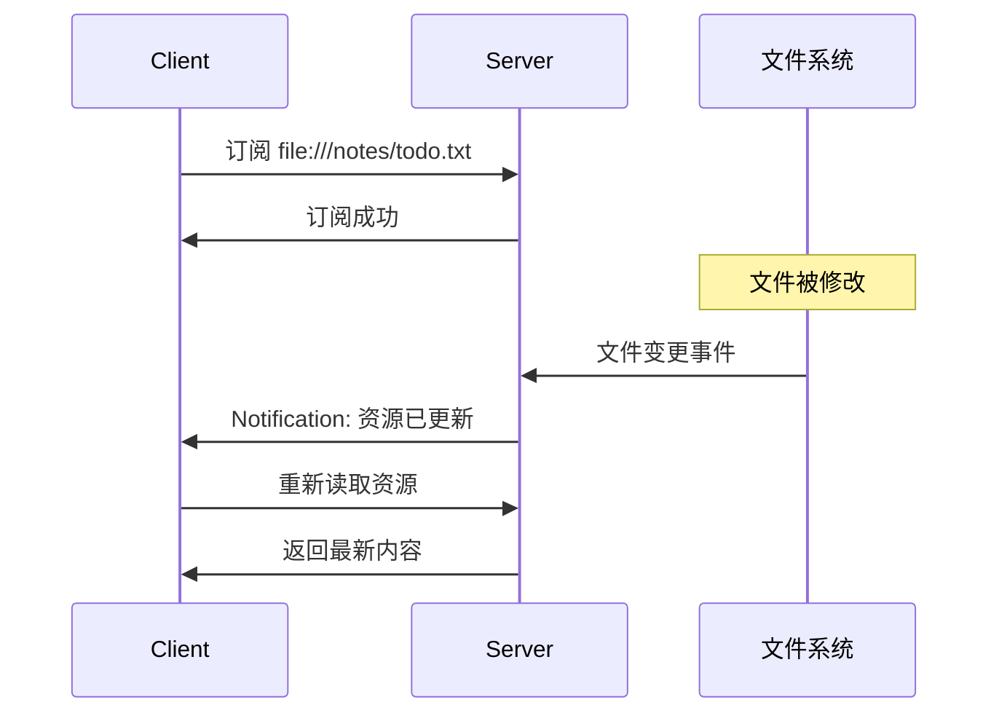
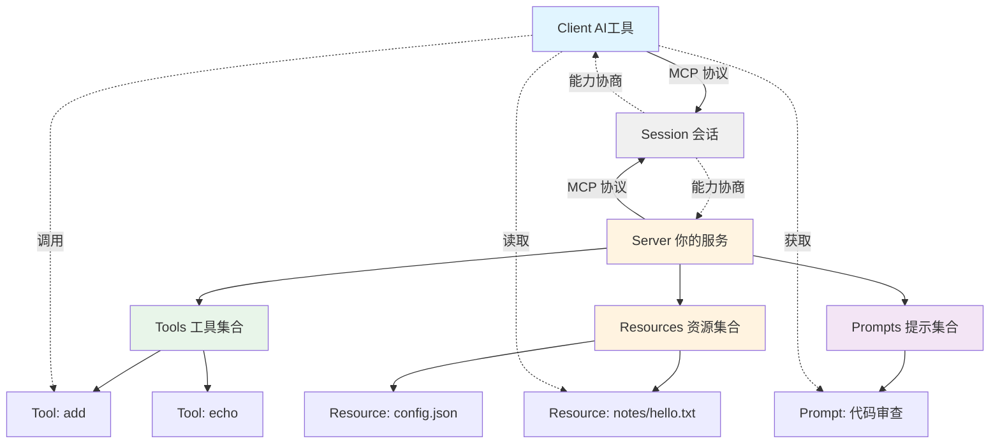
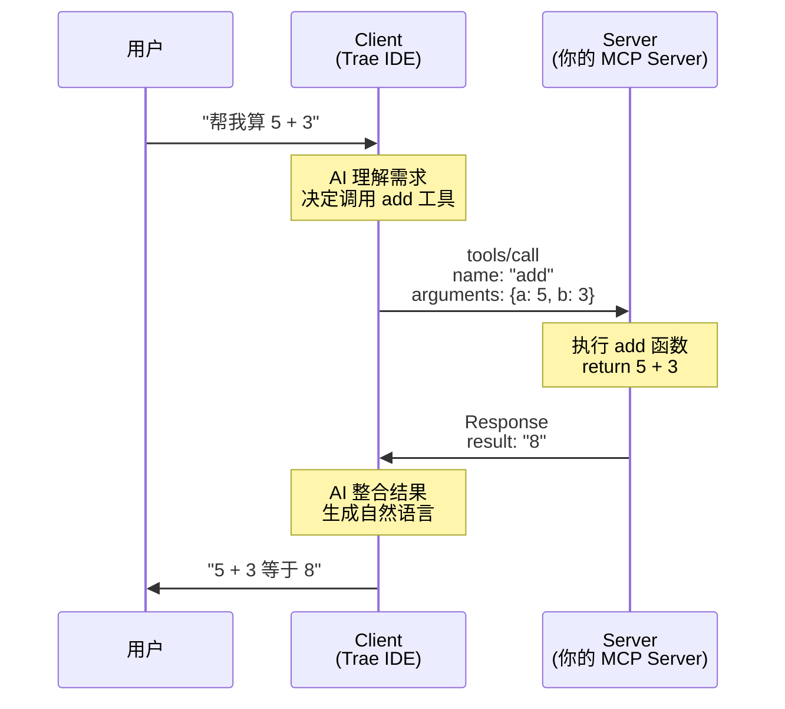

# 核心概念：MCP 如何工作

在这一章，我们将用图示和类比的方式，理解 MCP 的核心工作机制。别担心，这里不会有复杂的协议细节！

## 一、整体架构：Client 和 Server

### 类比：餐厅点餐系统

把 MCP 想象成一个餐厅点餐系统：

- **Client（顾客）**：AI 工具，比如 Trae IDE、Claude、ChatGPT
  - 需要某些能力（查天气、读文件、计算）
  - 发起请求（"给我查今天天气"）

- **Server（后厨）**：你开发的服务
  - 提供能力（工具、数据）
  - 响应请求并返回结果

- **MCP 协议（菜单和点餐流程）**：标准化的通信规范
  - 顾客看菜单（能力协商）
  - 顾客下单（发送请求）
  - 后厨做菜（处理请求）
  - 服务员上菜（返回响应）



> 来源：基于 [MCP 架构说明](https://modelcontextprotocol.io) 简化

## 二、消息模型：三种消息类型

MCP 基于 **JSON-RPC 2.0** 协议，有三种消息类型（不用担心，fastmcp 会帮你处理所有细节）：

### 1. Request（请求） - 需要回复

**类比：** 你问服务员"还有草莓蛋糕吗？"，期待得到"有"或"没有"的答复。

**例子：** Client 请求调用 `add` 工具
```json
{
  "method": "tools/call",
  "params": {
    "name": "add",
    "arguments": {"a": 5, "b": 3}
  }
}
```

### 2. Response（响应） - 对请求的回复

**类比：** 服务员回答"有草莓蛋糕"。

**例子：** Server 返回计算结果
```json
{
  "result": {
    "content": [
      {"type": "text", "text": "8"}
    ]
  }
}
```

### 3. Notification（通知） - 单向消息

**类比：** 餐厅广播"现在是午市特惠时间"，不需要顾客回复。

**例子：** Server 通知资源已更新（用于资源订阅）
```json
{
  "method": "notifications/resources/updated",
  "params": {"uri": "file:///notes/todo.txt"}
}
```

> 来源：基于 JSON-RPC 2.0 规范和 [MCP 消息模型](https://modelcontextprotocol.io)

## 三、会话生命周期：从握手到结束

### 类比：进餐厅到离开的完整流程



**关键阶段解释：**

**阶段 1：握手与能力协商（就像进餐厅看菜单）**
1. Client 说："你好，我是 Trae IDE，我支持这些功能……"
2. Server 回答："欢迎！我能提供这些工具和资源……"
3. Client 确认："好的，我们开始吧！"

**阶段 2：正常交互（点菜和用餐）**
- Client 可以：
  - 列出所有工具（`tools/list`）
  - 调用工具（`tools/call`）
  - 列出资源（`resources/list`）
  - 读取资源（`resources/read`）
  - 获取提示模板（`prompts/list`, `prompts/get`）

**阶段 3：结束（结账离开）**
- 连接关闭，会话结束

> 来源：基于 [MCP 会话流程](https://modelcontextprotocol.io) 设计

## 四、核心组件详解

### 1. Tool（工具）- 可调用的函数

**类比：** 餐厅的服务项目——"帮你加热"、"打包外带"、"切成小块"

**特点：**
- AI 可以主动调用
- 需要定义输入参数和返回值
- 用于**执行操作**（计算、查询、修改数据等）

**示例场景：**
- `get_weather(city)` - 查询天气
- `send_email(to, subject, body)` - 发送邮件
- `calculate(expression)` - 计算表达式

```python
# 用 fastmcp 定义一个工具超级简单
@mcp.tool()
def add(a: int, b: int) -> int:
    """两数相加"""  # 这个描述会告诉 AI 这个工具的用途
    return a + b
```

### 2. Resource（资源）- 可读取的数据

**类比：** 餐厅的菜单、今日特价表、店内装饰照片——顾客可以"看"，但不能"操作"

**特点：**
- AI 可以列举和读取
- 通常用 URI 标识（如 `file:///path/to/file`）
- 支持**订阅**（资源变化时主动通知 Client）
- 用于**提供上下文信息**

**示例场景：**
- `file:///notes/todo.txt` - 待办事项
- `database://users/profile` - 用户资料
- `api://weather/current` - 实时天气数据

```python
# 用 fastmcp 定义资源
@mcp.resource("file://notes/{filename}")
def read_note(filename: str) -> str:
    """读取笔记文件"""
    with open(f"notes/{filename}", "r") as f:
        return f.read()
```

### 3. Prompt（提示模板）- 可复用的提示词

**类比：** 餐厅的"套餐组合"——已经配好的搭配方案

**特点：**
- 预设的提示词模板
- 可以包含参数（动态填充）
- 帮助用户快速开始对话

**示例场景：**
- "代码审查"模板
- "翻译助手"模板
- "数据分析"模板

```python
# 用 fastmcp 定义提示模板
@mcp.prompt()
def code_review_prompt(code: str) -> str:
    """代码审查提示"""
    return f"请审查以下代码，关注性能和安全性：\n\n{code}"
```

> 来源：基于 [MCP 核心概念](https://modelcontextprotocol.io) - Tools, Resources, Prompts

## 五、能力协商（Capabilities）

### 类比：会前自我介绍

在餐厅，服务员会告诉你"我们有堂食、外卖、预定服务"。在 MCP 中，Server 和 Client 也会互相声明自己的能力。

**Server 能力示例：**
```json
{
  "capabilities": {
    "tools": {},           // 我提供工具
    "resources": {
      "subscribe": true    // 我的资源支持订阅
    },
    "prompts": {}          // 我提供提示模板
  }
}
```

**Client 能力示例：**
```json
{
  "capabilities": {
    "sampling": {}         // 我能调用 LLM 进行采样
  }
}
```

**为什么需要能力协商？**
- 让双方知道对方能做什么
- 避免调用不存在的功能
- 支持协议的渐进式增强（旧 Client 可以忽略新功能）

> 来源：基于 [MCP 能力协商机制](https://modelcontextprotocol.io)

## 六、资源订阅：实时通知机制

### 类比：关注网盘文件夹

你关注了一个共享文件夹，当有人上传新文件时，你会收到通知——不需要反复刷新检查。



**使用场景：**
- 监控日志文件变化
- 跟踪配置文件更新
- 实时同步数据库变更

> 来源：基于 [MCP 资源订阅机制](https://modelcontextprotocol.io)

## 七、对象关系图

让我们用一张图总结所有核心对象的关系：



## 八、工具调用完整流程

最后，让我们看看 AI 调用一个工具的完整流程：



**流程说明：**
1. 用户用自然语言提问
2. AI（Client）理解意图，决定调用哪个工具
3. Client 发送 `tools/call` 请求给 Server
4. Server 执行对应函数，返回结果
5. Client 将结果整合到自然语言回复中
6. 用户看到最终答案

> 来源：基于 [MCP 工具调用流程](https://modelcontextprotocol.io)

## 小结

现在你已经理解了：

✅ Client 和 Server 的角色（顾客和餐厅）
✅ 三种消息类型（请求、响应、通知）
✅ 会话生命周期（握手 → 交互 → 结束）
✅ 三大核心组件（Tool、Resource、Prompt）
✅ 能力协商机制（互相自我介绍）
✅ 资源订阅（文件夹通知）
✅ 完整的调用流程（从用户提问到得到答案）

**重要提示：** 用 fastmcp 框架时，以上所有复杂细节都会被自动处理。你只需要：
- 用 `@mcp.tool()` 定义函数
- 用 `@mcp.resource()` 定义资源
- 用 `@mcp.prompt()` 定义提示

下一章，我们就来动手写第一个真正能跑的 MCP Server！

👉 [下一章：复制就能跑的最小 MCP Server](./03-fastmcp-quickstart.md)

---

**参考资料**
- MCP 架构设计：https://modelcontextprotocol.io
- JSON-RPC 2.0 规范：MCP 基于此协议构建消息模型
- fastmcp 快速开始：https://gofastmcp.com
- 核心引用："MCP is an open-source standard for connecting AI applications to external systems" (modelcontextprotocol.io)
