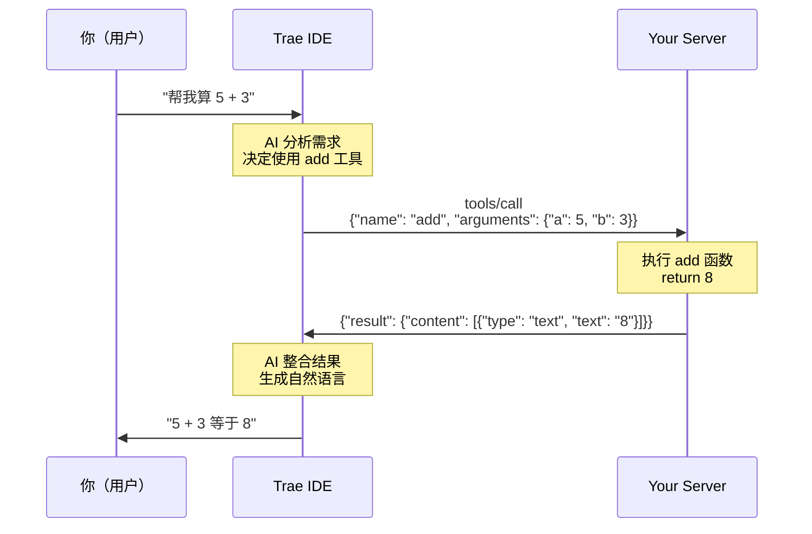

# 扩展功能并连接客户端

在上一章，我们创建了一个最小的 MCP Server。现在让我们做一点小改进，然后用现成的客户端来测试它！

## 目标

本章将：

1. ✅ 扩展资源功能：支持读取任意指定的笔记文件
2. ✅ 用 Trae IDE（支持 MCP 的 AI 编程工具）连接你的 Server
3. ✅ 实际调用工具和读取资源，验证闭环

## 步骤一：扩展资源功能

### 1.1 添加更多测试文件

先创建几个测试文件：

```bash
# 在项目目录下执行
echo "今天要学习 MCP 协议" > notes/todo.txt
echo "Python 是一门优雅的语言" > notes/python.txt
```

### 1.2 修改 server.py

打开 `server.py`，找到资源定义部分，替换为以下代码：

```python
# ============================================
# 资源定义（Resources）
# ============================================

@mcp.resource("file://notes/hello.txt")
def read_hello() -> str:
    """
    读取欢迎文件（静态资源）

    URI: file://notes/hello.txt
    """
    try:
        with open("notes/hello.txt", "r", encoding="utf-8") as f:
            return f.read()
    except Exception as e:
        return f"错误：{str(e)}"


@mcp.resource("file://notes/{filename}")
def read_note(filename: str) -> str:
    """
    读取指定的笔记文件（动态资源）

    这是一个参数化资源，支持读取 notes/ 目录下的任意 .txt 文件

    参数：
        filename: 文件名（例如：todo.txt, python.txt）

    URI 示例：
        - file://notes/todo.txt
        - file://notes/python.txt

    来源：基于 MCP Resource 规范的动态资源实现
    """
    # 安全检查：防止路径遍历攻击
    if ".." in filename or "/" in filename:
        return "错误：非法文件名，不允许包含 '..' 或 '/'"

    filepath = f"notes/{filename}"

    try:
        with open(filepath, "r", encoding="utf-8") as f:
            content = f.read()
        return f"文件：{filename}\n\n{content}"
    except FileNotFoundError:
        return f"错误：文件 {filename} 不存在"
    except Exception as e:
        return f"错误：读取失败 - {str(e)}"
```

### 1.3 理解改进点

**新增功能：动态资源**

```python
@mcp.resource("file://notes/{filename}")
def read_note(filename: str) -> str:
    ...
```

**关键特性：**

- **参数化 URI**：`{filename}` 是一个占位符

  - 客户端请求 `file://notes/todo.txt` 时，`filename="todo.txt"`
  - 客户端请求 `file://notes/python.txt` 时，`filename="python.txt"`

- **安全检查**：

  ```python
  if ".." in filename or "/" in filename:
      return "错误：非法文件名..."
  ```

  - 防止路径遍历攻击（如 `../../etc/passwd`）
  - 生产环境中必须做这类检查

- **友好的错误处理**：
  - 文件不存在时返回清晰的错误信息
  - 而不是让程序崩溃

### 1.4 重启 Server

停止之前的运行（`Ctrl+C`），然后重新启动：

```bash
python server.py
```

现在你的 Server 支持读取多个文件了！

## 步骤二：连接客户端测试

### 使用 Trae IDE（推荐）

Trae IDE 是一款支持 MCP 的 AI 编程工具，配置简单，使用方便。

#### 2.1 下载安装

访问 https://trae.ai 下载适合你系统的版本，或直接使用在线版本。

#### 2.2 配置 MCP Server

Trae IDE 提供了两种添加 MCP Server 的方式：

**方式一：手动添加（推荐用于本地开发）**

1. 打开 Trae IDE
2. 点击 **Settings（设置）** > **MCP**
3. 点击 **"+ Add"** > **"Add Manually"**
4. 输入 JSON 配置：

```json
{
  "command": "python",
  "args": ["/完整路径/my-first-mcp-server/server.py"],
  "env": {},
  "cwd": "/完整路径/my-first-mcp-server"
}
```

**注意事项：**

- 使用**绝对路径**（不能用 `~` 或相对路径）
- macOS/Linux 示例：`"/Users/yourname/my-first-mcp-server/server.py"`
- Windows 示例：`"C:\\Users\\yourname\\my-first-mcp-server\\server.py"`
- `cwd` 指定工作目录（Server 运行时所在的目录）
- `env` 可以添加环境变量（如 API keys），本例中为空对象

**方式二：从 Marketplace 添加（适合使用已发布的 Server）**

1. 打开 Trae IDE
2. 点击 **Settings** > **MCP**
3. 点击 **"+ Add MCP Servers"** 或 **"+ Add"** > **"Add from Marketplace"**
4. 浏览社区提供的 MCP Servers
5. 找到需要的 Server，点击 **"+"** 添加

#### 2.3 将 Server 添加到 Agent

配置完成后，你的 MCP Server 会：

- 自动添加到 **"Builder with MCP"** agent
- 也可以手动添加到自定义 agent：
  1. 在 MCP server 列表中找到你的 Server
  2. 选择要使用该 Server 的 agent
  3. 确认添加

#### 2.4 测试工具调用

在 Trae IDE 的对话框中输入：

```
帮我算一下 42 + 58 等于多少
```

如果 AI 调用了你的 `add` 工具，你会看到类似的回复：

```
我来帮你计算：42 + 58 = 100
```

再试试 `echo` 工具：

```
用 echo 工具给我回显"Hello MCP"
```

#### 2.5 测试资源读取

```
请读取 file://notes/hello.txt 资源
```

或者：

```
请读取 file://notes/todo.txt 资源，看看里面写了什么
```

Trae IDE 会调用你的资源函数，并显示文件内容。

**提示：** Trae IDE 支持三种传输类型（stdio、SSE、Streamable HTTP）。本教程使用的是 stdio（标准输入输出），这是本地 MCP Server 的默认方式。

### 其他选项：MCP Inspector（调试工具）

如果你想直接测试 MCP Server，不依赖 AI 客户端，可以使用 **mcp-inspector**。

#### 安装和使用

```bash
npx @modelcontextprotocol/inspector python server.py
```

Inspector 会打开一个网页界面，你可以：

- 查看所有工具和资源
- 手动调用工具（输入参数）
- 手动读取资源
- 查看请求和响应的原始 JSON

这对于调试非常有用！

### 其他支持 MCP 的客户端

越来越多的工具开始支持 MCP，包括：

- **Claude Desktop**：Anthropic 官方桌面应用
- **Cursor IDE**：代码编辑器
- **Continue**：VSCode 插件
- **Cline**：AI 编程助手

配置方式类似，都是提供 Server 的启动命令和工作目录。

## 步骤三：验证闭环

确保以下场景都能成功：

### 测试清单

- ☑️ **工具调用 - add**

  - 输入：`帮我算 5 + 3`
  - 预期：AI 返回 8

- ☑️ **工具调用 - echo**

  - 输入：`用 echo 工具回显"测试"`
  - 预期：AI 返回 "你说：测试"

- ☑️ **资源读取 - 静态资源**

  - 输入：`读取 file://notes/hello.txt`
  - 预期：显示文件内容

- ☑️ **资源读取 - 动态资源**

  - 输入：`读取 file://notes/todo.txt`
  - 预期：显示待办事项内容

- ☑️ **错误处理**
  - 输入：`读取 file://notes/notexist.txt`
  - 预期：返回友好的错误信息

## 理解整个流程

让我们回顾一下当你说"帮我算 5 + 3"时发生了什么：



**流程说明：**

1. 用户用自然语言提问
2. Trae IDE 中的 AI 理解意图，从你 Server 的工具列表中选择合适的工具
3. Trae IDE 发送 `tools/call` 请求给你的 Server
4. fastmcp 接收请求，调用对应的 Python 函数
5. 函数返回结果
6. fastmcp 将结果包装成 MCP 响应格式
7. Trae IDE 接收结果，整合到自然语言回复中
8. 用户看到最终答案

**关键点：**

- 你的 Python 函数只需要关注业务逻辑（加法运算）
- 所有 MCP 协议细节（JSON-RPC、能力协商、消息格式）都由 fastmcp 处理
- 这就是 fastmcp 的价值——让你专注于功能，而不是协议

## 小结

恭喜！你已经：

✅ 扩展了资源功能，支持动态读取文件
✅ 添加了安全检查（防止路径遍历）
✅ 配置了 MCP 客户端
✅ 成功调用了工具和读取了资源
✅ 理解了完整的调用流程

你现在拥有一个真正能用的 MCP Server！

**重要提示：**

- 这个 Server 运行在本地，只有你能用
- Client 和 Server 通过 stdio（标准输入输出）通信
- 不需要网络配置，不需要担心端口问题

下一章，我们将回答常见问题，并提供进阶学习的方向。

👉 [下一章：FAQ 与进阶路线](./05-faq-and-next.md)

---

**参考资料**

- Trae IDE 官网：https://trae.ai
- Trae MCP 文档：https://docs.trae.ai/ide/model-context-protocol
- MCP Inspector：https://github.com/modelcontextprotocol/inspector
- fastmcp 动态资源：支持 URI 中的参数占位符
- stdio 传输：MCP 客户端通过进程的标准输入输出与 Server 通信
- 安全提示：生产环境中的资源访问必须做严格的权限检查和路径验证
