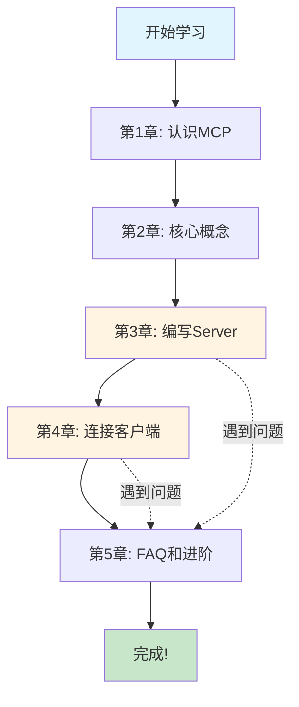

# MCP Server 快速入门 - 学习路线图

## 📚 教程总览

欢迎！这是一份为**零基础初学者**设计的 MCP Server 开发教程。

完成时间：**30-45 分钟** | 难度：**入门级** | 技术栈：**Python + fastmcp**

## 🎯 学习目标

跟随本教程，你将：
1. 理解 MCP 协议的核心价值
2. 使用 fastmcp 构建第一个 MCP Server
3. 实现可调用的工具（Tool）和可读取的资源（Resource）
4. 连接客户端并完成端到端测试

## 📖 章节导航

### 第一站：理解为什么
[**第 1 章：认识 MCP**](./01-what-and-why-mcp.md) ⏱️ 5-8 分钟

🔑 关键问题：
- MCP 是什么？为什么需要它？
- 它解决了什么实际问题？
- 学完教程我能做什么？

💡 核心类比：MCP 就像 AI 的"USB 标准"

---

### 第二站：理解怎么工作
[**第 2 章：核心概念易懂版**](./02-mcp-basics-concepts.md) ⏱️ 10-15 分钟

🔑 关键概念：
- Client 和 Server（顾客和餐厅）
- 三种消息类型（请求、响应、通知）
- 会话生命周期（握手 → 交互 → 结束）
- Tool、Resource、Prompt 的区别

📊 包含 6 个 Mermaid 图表，图文并茂！

---

### 第三站：动手实践
[**第 3 章：最小 MCP Server**](./03-fastmcp-quickstart.md) ⏱️ 10-15 分钟

🔑 实操内容：
- ✅ 安装 uv 和 fastmcp
- ✅ 编写完整的 server.py（约 50 行）
- ✅ 实现 2 个工具：echo, add
- ✅ 实现 1 个资源：读取本地文件
- ✅ 运行并验证

💻 可直接复制运行的完整代码！

---

### 第四站：扩展和测试
[**第 4 章：扩展功能并连接客户端**](./04-extend-and-use.md) ⏱️ 10-15 分钟

🔑 实战任务：
- 🔧 扩展资源：支持动态读取任意文件
- 🔌 配置 Trae IDE 连接你的 Server
- 🧪 实际调用工具和读取资源
- 📊 理解完整的端到端流程

✅ 包含配置文件示例和测试清单！

---

### 第五站：解惑和进阶
[**第 5 章：FAQ 与进阶路线**](./05-faq-and-next.md) ⏱️ 5-10 分钟

🔑 扫除障碍：
- ❓ 6 个常见问题及解决方案
- 📋 术语速查表（一页速查）
- 🎓 4 阶段进阶学习路线
- 🔗 官方资源和社区链接

---

## 🚀 快速通道

### 我是急性子，直接看代码！
→ 跳转到 [第 3 章](./03-fastmcp-quickstart.md)，复制代码直接跑

### 我想理解原理再动手
→ 从 [第 1 章](./01-what-and-why-mcp.md) 按顺序阅读

### 我已经跑起来了，但遇到问题
→ 直接看 [第 5 章 FAQ](./05-faq-and-next.md)

### 我想看完整教程说明
→ 阅读 [README](./README.md)

## 📊 学习路线图（可视化）

## ✅ 学习检查清单

在开始之前，确保：
- [ ] 你的电脑上已安装 Python 3.10+
- [ ] 你知道如何使用终端/命令行
- [ ] 你有 30-45 分钟的专注学习时间

完成教程后，你应该能够：
- [ ] 解释 MCP 是什么以及为什么重要
- [ ] 区分 Tool 和 Resource 的不同用途
- [ ] 独立编写一个包含工具和资源的 MCP Server
- [ ] 配置客户端连接并测试你的 Server
- [ ] 排查常见的配置和路径问题

## 🎓 教程特色

| 特色 | 说明 |
|------|------|
| 🎯 **零门槛** | 面向绝对初学者，用类比和故事解释 |
| ⚡ **快速上手** | 30 分钟内运行第一个 Server |
| 🔧 **只讲 Server** | 不涉及 Client 开发和复杂协议 |
| 🐍 **只用 fastmcp** | 极大简化开发复杂度 |
| 📊 **图文并茂** | 6 个 Mermaid 图表辅助理解 |
| 📝 **来源明确** | 所有内容基于官方文档标注 |

## 🆘 需要帮助？

- 📖 查看 [FAQ 章节](./05-faq-and-next.md)
- 🌐 访问 [MCP 官方网站](https://modelcontextprotocol.io)
- 💬 参与 [MCP 社区讨论](https://github.com/modelcontextprotocol/specification/discussions)
- 📚 阅读 [fastmcp 文档](https://gofastmcp.com)

## 🎉 准备好了吗？

让我们从第一章开始吧！

👉 [开始学习：认识 MCP](./01-what-and-why-mcp.md)

---

祝学习愉快！记住：**每个专家都曾是初学者** 🚀
